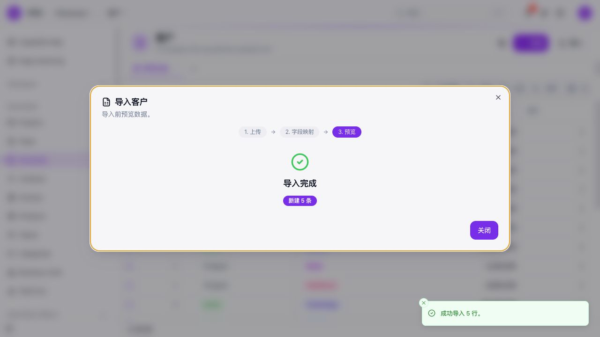
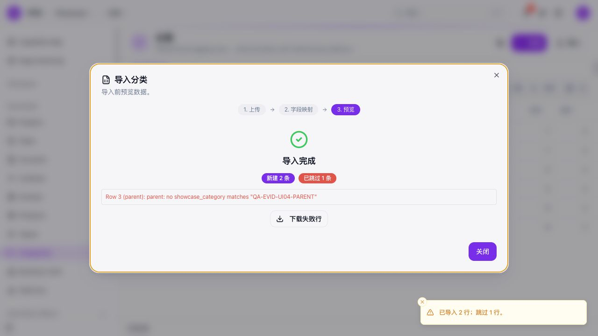
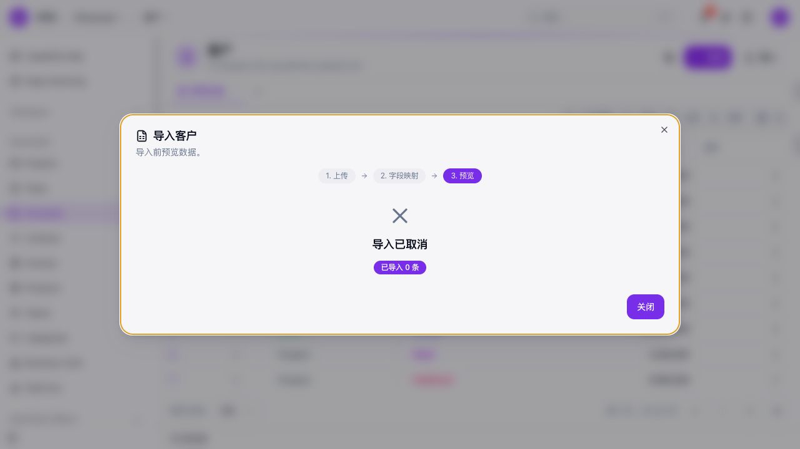
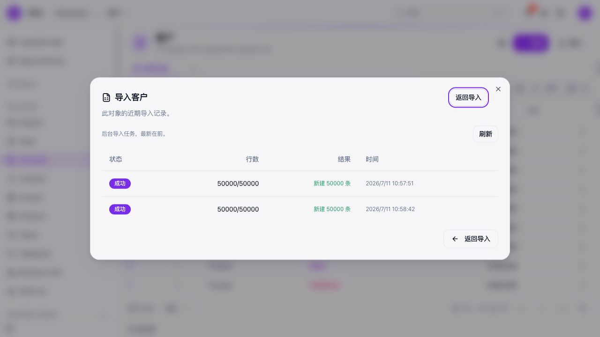

# framework #2678 / PR #2680 最终 QA 报告

## 技术结论

- **批量写入主路径达到性能与调用次数目标。** Seed、Import 和真实 Showcase API 均确认使用共享 bulk helper；batch size 200 时，1,000 行产生 5 次批量写入而不是 1,000 次单条写入。
- **功能验收并未全部通过。** 逻辑坏行隔离、批次调用次数、summary 上界及普通导入语义通过；瞬时重试覆盖、batch 返回契约和同文件 lookup 语义存在确认问题。
- **UI 主流程可用，但取消链路存在端到端矛盾。** 基础导入、201 行边界、upsert、非法行隔离、历史、撤销、50,001 上限和 automation context 通过；同文件 lookup 失败，运行中取消 50,000 行任务无效且前端误报已取消。
- **共确认并独立复现 10 个 Issue。** 其中 8 个为 `ready-stable`，2 个因真实 Turso/libSQL 错误形态未验证而为 `ready-with-boundary`；没有待补评论、待重现或本地环境阻塞项。
- **本轮只测试，不修复。** Framework 与 ObjectUI 产品代码未修改；结论适用于下述固定版本和本地 SQLite/UI 环境，不能外推为云端通过。

## 固定版本与判定范围

| 项目 | 固定值 |
|---|---|
| 原始任务 | [framework #2678](https://github.com/objectstack-ai/framework/issues/2678) |
| 实现 PR | [framework #2680](https://github.com/objectstack-ai/framework/pull/2680) |
| Framework 测试基线 | `98874656ffc50ce1531af52346228ffcdda73fba` |
| PR 合并归因基线 | `21420d9f82ebdcd53a6361ded3d829723bcab18e` |
| ObjectUI 固定版本 | `80901aad44ff3beeaf7882ec3367da934325b2f2` |
| 主要运行环境 | Node.js 22.14.0、pnpm 10.31.0、本地 SQLite、Showcase、固定 ObjectUI |
| 测试日期 | 2026-07-11（Asia/Shanghai） |

本报告中的 `passed` 表示返回结果、调用次数、HTTP/UI 状态和持久化数据至少一项经过明确断言或对账；仅进程 exit 0 不构成功能通过。`ready-with-boundary` 表示本地问题已经稳定成立，但云端错误对象或外部部署条件未验证。

UI 验证使用内置浏览器新会话、固定 ObjectUI 和全新后端登录态。现有工具不能证明操作系统级 headless 与临时空 profile，维护者明确接受该隔离例外；未使用日常浏览器、既有登录态或 HotCRM 环境。

## #2678 验收并非全绿

| 验收目标 | 结果 | 关键证据 |
|---|---|---|
| Seed/Import 使用共享 bulk helper | **Passed** | helper、真实 SQLite Seed、真实 Import/REST、Showcase HTTP 均进入批量路径 |
| 写入次数约为 `ceil(N / batchSize)` | **Passed** | 1,000/200 = 5 次；5,000 = 25 批；50,000 = 250 批 |
| 瞬时错误重试且不丢行 | **Partial failure** | bulk/update 支持路径通过；#2802、#2804、#2805 暴露分类、兼容路径和 deferred update 缺口 |
| 逻辑错误按行隔离 | **Passed** | Seed 与 Import 坏行场景保留 199/200 条有效记录和原始失败行号 |
| Summary 重算受唯一父记录数约束 | **Passed** | 每批按唯一父项去重；同一父项 5 批重算 5 次，十父项 5 批重算 50 次 |
| 每行结果与 ID 关联安全 | **Failed** | short/long/reverse/non-array 响应未被安全拒绝，真实 Import/undo 受影响（#2803） |
| 既有 Import 语义不回归 | **Failed** | 同文件新父记录在 buffered bulk 路径中对后续 lookup 不可见（#2806） |

因此，#2680 已实现批量化的主要收益，但不能以“所有 #2678 验收条件均通过”作为发布结论。

## 覆盖深度足以支持上述结论

| 层级 | 执行结果 | 作用 |
|---|---:|---|
| 最终专项自动化 | 5/5 commands、6/6 files、245/245 tests | 固定受影响模块的干净源码回归 |
| 受影响包基线 | 2,332 passed、2 skipped | core、metadata、objectql、driver-sql、rest、runtime 与 dogfood 基线 |
| Core 契约/故障模型 | 11 场景组：5 passed、6 finding/risk | batching、重试、降级、结果契约和 exactly-once 风险 |
| 真实 SQLite Seed | 20 场景组：16 passed、4 finding | 类型、模式、顺序、summary、deferred reference 与 context |
| Import/REST 集成 | 28 场景组：22 passed、6 finding | 同步/异步、upsert、坏行、retry、undo、CSV 与 lookup |
| 真实 Showcase HTTP | 10 场景组：9 passed、1 finding | 真实对象、持久化、重启和异步边界 |
| UI dogfood | UI-01～06 全部执行 | UI、HTTP API 与 SQLite 三方对账 |
| Issue 独立复现审计 | 10/10 Issue 覆盖 | 仅依据 Issue 正文/评论重新构造并验证复现规则 |

自定义 Core/Seed/Import/Showcase 合计 69 个场景组，其中 52 个通过，17 个形成 finding 或风险证据。这里的“finding”不是测试基础设施失败，而是 harness 成功断言产品实际行为与问题描述一致。

## 批量写入收益明确，但仅代表本地相对结果

### 调用次数与 summary

| 场景 | 结果 |
|---|---|
| 1,000 行，batch size 200 | 5 次 engine array insert + 5 次 driver bulkCreate；0 次单条 insert |
| 5,000 行 Import | 25 个批次 |
| 50,000 行异步 Import | 250 个批次并完整落库 |
| 50,001 行 | 明确拒绝为 `PAYLOAD_TOO_LARGE` |
| 1 个父项、1,000 个子项、5 批 | 5 次 summary 重算；持久化汇总值为 1,000 |
| 10 个父项、1,000 个子项、5 批 | 50 次 summary 重算；每个父项持久化汇总值为 100 |

> **汇总口径说明（2026-07-17）：** 上表保留的是原 QA 报告记录的历史结果。原临时 fixture 和 harness 已在收尾时删除，因此现有证据无法确认 `1,000` / `100` 是 `COUNT` 汇总、所有子记录 `amount=1` 时的 `SUM`，还是把子记录数写成了持久化汇总值。后续 [#2678 评论区“问题一”](https://github.com/objectstack-ai/framework/issues/2678#issuecomment-4971283675)明确采用 `total_amount = SUM(amount)` 口径，并记录单父 `500500`、十父依次 `49600`～`50500`；后补重建验证沿用该明确口径。两组汇总数值不能表述为逐值一致，但 1,000 行分 5 批、单父重算 5 次、十父重算 50 次等结构性结论一致。

Summary 去重范围是**每个批次**，不是整次 load。相同父项跨批次仍会再次重算；#2678 将跨整次 load 的进一步折叠列为可选项，因此本报告不宣称全程只重算一次。

### 本地性能

测试条件：Apple M1、Node.js 22.14.0、本地 SQLite；100 行 warm-up 后，每种 1,000 行变体测量 5 次并取中位数。

| 1,000 行变体 | 单条写入 | 批量写入 | 本地相对改善 |
|---|---:|---:|---:|
| 无 summary | 334.97 ms | 11.98 ms | 约 28× |
| 启用 summary | 651.73 ms | 13.32 ms | 约 49× |

这些数据证明本机相对收益，不代表 Turso、云连接池、冷启动或远程绝对延迟。

## UI 主流程通过，lookup 与取消链路失败

| UI 场景 | 结果 | UI/API/SQLite 对账结论 |
|---|---|---|
| UI-01 基础 5 行 CSV | **Passed** | 4 列自动映射，5/5 新建，三方字段值一致 |
| UI-02 201 行边界 | **Passed** | 201/201，名称唯一、数值范围正确，无 off-by-one |
| UI-03 upsert + 非法行 | **Passed** | 2 新建、2 更新、2 跳过；非法 status 和空匹配键未落库 |
| UI-04 同文件 lookup | **Failed** | 已有父项可解析，新父项可创建，但后续行无法引用同文件新父项（#2806） |
| UI-05 async/history/undo/limit | **Partial failure** | 进度、刷新历史、Undo 和 50,001 上限通过；取消 50,000 行任务无效（#2824、objectui#2393） |
| UI-06 automation context | **Passed** | 关闭/开启分别持久化为 `run_automations=0/1`，对应 `skipAutomations=true/false` |

### 代表性界面证据

基础导入证明 UI 字段映射和结果页正常：

同文件 lookup 的失败边界是“已有父项正常、新父项对后续行不可见”：

取消链路出现前后端矛盾。向导报告“已取消 / 0 条”，但同一作业历史最终为成功 50,000/50,000：

完整 10 张截图及映射见[证据索引](README.md)。截图用于支持文字复现，最终判定仍以 UI、HTTP API、作业表和业务表的组合证据为准。

## 10 个 Issue 均可由独立审计重现

独立审计只依据各 Issue 正文和评论重建输入；旧数据库、旧服务和隐藏会话状态不作为复现条件。所有有效产品运行均与原结论一致。

| Issue | 独立重现 | 状态 | 与 #2678 / #2680 的关系 |
|---|---|---|---|
| [framework #2801](https://github.com/objectstack-ai/framework/issues/2801) | 错误命令 1/1 失败；替代命令 1/1 成功 | `ready-stable` | #2680 前既存的文档/参数转发问题，属于附带发现 |
| [framework #2802](https://github.com/objectstack-ai/framework/issues/2802) | classifier 1/1 | `ready-with-boundary` | #2680 新增 classifier 的接受范围缺口；真实云端错误对象未测 |
| [framework #2803](https://github.com/objectstack-ai/framework/issues/2803) | short/long/reverse/non-array 各 1/1 | `ready-stable` | #2680 batch 响应类型、长度和相关性契约缺口 |
| [framework #2804](https://github.com/objectstack-ai/framework/issues/2804) | 自引用 Seed、无 bulk protocol Import 各 1/1 | `ready-with-boundary` | #2678 验收覆盖缺口；不宣称为相对 #2680 前语义的回归 |
| [framework #2805](https://github.com/objectstack-ai/framework/issues/2805) | fresh SQLite 1/1 | `ready-stable` | #2680 前既存，影响 Seed 成功/错误记账可信度 |
| [framework #2806](https://github.com/objectstack-ai/framework/issues/2806) | fresh SQLite 1/1 | `ready-stable` | #2680 buffering 引入的同文件 lookup 回归 |
| [framework #2807](https://github.com/objectstack-ai/framework/issues/2807) | 两类 CSV 歧义各 1/1 | `ready-stable` | parser/design validation gap，不是 #2678/#2680 回归 |
| [framework #2823](https://github.com/objectstack-ai/framework/issues/2823) | fresh UI 栈 1/1 | `ready-stable` | 与 Import/#2680 独立的 Showcase 导航附带问题 |
| [framework #2824](https://github.com/objectstack-ai/framework/issues/2824) | 独立 50,000 行取消 1/1 | `ready-stable` | #2678 E2E 发现的服务端取消缺口，不宣称由 #2680 引入 |
| [objectui #2393](https://github.com/objectstack-ai/objectui/issues/2393) | 与 #2824 共享同一运行 1/1 | `ready-stable` | 同一端到端故障的前端误报边界，分仓库修复 |

上述本轮独立复现不计进入产品逻辑前的临时 harness 转换或启动诊断失败。#2824 与 objectui #2393 使用同一次端到端运行，分别验证服务端终态和前端呈现，不重复计算为两次产品运行。

## 仍然不能从本地结果推断云端可靠性

以下项目未在真实云环境验证，未标记为通过或失败：

- 真实 Turso/libSQL 错误对象及错误文本；
- 远程批次已提交但响应丢失；
- 云连接池限制与冷启动；
- 远程绝对延迟；
- HotCRM 事故环境；
- 取消链路在云端或外部部署中的行为。

Exactly-once 仍是显式风险：远程批次若已提交但客户端未收到响应，使用自动 ID 重试可能产生重复记录。#2678 定义了 retry，但没有定义幂等键或 commit/ack 契约；因此该项记录为风险，不冒充已确认 Bug。

对 #2824，SQLite 同步工作可能阻塞取消请求只是候选解释。当前证据确认“用户无法取消且最终完整成功”，但没有通过 instrumentation 确认精确事件循环根因。

## 建议按正确性风险安排修复与回归

1. **优先处理数据正确性回归：** #2803（结果/ID 关联）与 #2806（同文件 lookup）。
2. **补齐 #2678 重试承诺：** #2802、#2804，并处理会误报成功的 #2805。
3. **成对处理取消链路：** framework #2824 负责服务端终态，objectui #2393 负责前端呈现；保持两个 Issue、一次端到端回归。
4. **独立排期附带问题：** #2801、#2807、#2823 不应扩大到 #2680 修复范围中。
5. **每个修复完成后执行最小对应复现，再执行 245 项专项回归。** 涉及 UI 的修复只补跑对应 UI 场景，无需重新执行整套 QA。
6. **云端验证单独立项。** 使用真实 Turso/libSQL 和可控故障注入验证错误分类、响应丢失与取消行为。

## 追溯材料

本文件是面向维护者的唯一最终 QA 报告。以下文件仅用于审计追溯，不是理解结论的前提：

- [原始执行计划](test-plan.md)
- [完整执行底稿](qa-report.md)
- [Issue 可复现性审计底稿](issue-repro-audit-report.md)
- [三组分项审计与全部截图索引](README.md)

## 后补：重建数据源与重新验证（2026-07-17）

原临时 fixture 已删除，无法再作为可复核输入。本后补不改写上文的历史结论；它使用**根据 #2678 评论区“问题一”已发布的字段、批次和金额明细重建并重新验证的数据源**，在同一固定 Framework 提交 `98874656ffc50ce1531af52346228ffcdda73fba` 上，仅重新执行“问题一：批量写入与汇总计算”。

重建脚本从同一组确定性内存数据同时生成实际测试 CSV、`expected-results.json` 和便于人工查看的 Excel。Excel 由 artifact-tool 生成，7 个工作表均完成数据、公式和视觉检查，公式错误扫描为 0。真实 SQLite harness 只用包装器记录调用次数，每次调用都委托给原产品实现；未模拟写入成功、未修改 Framework 产品行为。

重新验证结果与 #2678 评论区“问题一”已发布的批次、汇总次数及金额明细一致；针对重建数据的预期值与实际值逐项比较 88 项全部通过、0 项差异。这不表示重建数据与已删除的原临时 fixture 逐行相同：

- Seed 1,000 行：5 次 200 行批量写入，0 次单条写入；
- Import 1,000 行：5 个 200 行批次，0 次单条创建；
- 单父场景：1,000 个子记录，summary 重算 5 次，持久化总额 `500500`；
- 10 父场景：每个父记录 100 行，summary 共重算 50 次，持久化金额依次为 `49600`～`50500`；
- 记录数、唯一键、父子关系、数据库重新求和和 SQLite `integrity_check` 均正确。

完整可复跑证据：

- [重建归档说明与复跑入口](reconstructed-fixtures/README.md)
- [Excel 数据工作簿](reconstructed-fixtures/data/issue-2678-reconstructed-data-source.xlsx)
- [CSV 数据与期望值](reconstructed-fixtures/data/expected-results.json)
- [生成脚本](reconstructed-fixtures/source/generate-fixtures.mjs)
- [完整 harness](reconstructed-fixtures/source/revalidate-problem-one.ts)与[对象定义](reconstructed-fixtures/source/object-definitions.ts)
- [原始 JSON 结果](reconstructed-fixtures/results/raw-results.json)与[逐项重测报告](reconstructed-fixtures/results/comparison-report.md)
- [完整命令台账](reconstructed-fixtures/command-ledger.md)与[stdout/stderr](reconstructed-fixtures/commands/)
- [测试完成后的 SQLite 数据库](reconstructed-fixtures/database/problem-one.sqlite)
- [运行环境与测试参数](reconstructed-fixtures/environment/runtime.json)
- [归档 manifest](reconstructed-fixtures/manifest.json)与[SHA-256](reconstructed-fixtures/SHA256SUMS)
