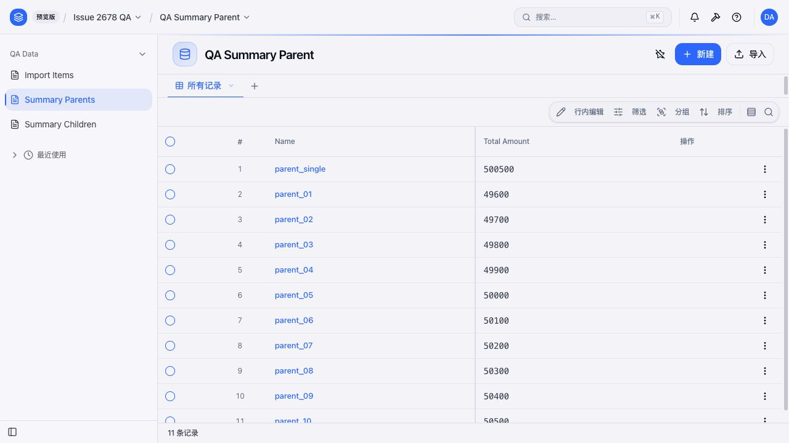

# Issue #2678 UI QA 软件包——运行验证记录

> 本文件是留档用的验证证据。普通使用者无需阅读；实际操作请按 [README](README.md) 开头的两条命令执行。

## 固定环境

| 项目 | 值 |
|---|---|
| 验证时间 | 2026-07-17 12:44 CST（Asia/Shanghai） |
| 人工 CSV 完整验收 | 2026-07-17 17:14 CST（Asia/Shanghai） |
| Framework 提交 | `afa81155fb79846978c3ba6d94876edd21658f1d`（运行前工作树干净） |
| Framework CLI | `@objectstack/cli/13.0.0`，直接执行 `packages/cli/bin/run.js` |
| 内置 ObjectUI 提交 | `7a68d78f2a0c3c1f99dafd39b75b4f117a24917b`（`.objectui-sha`） |
| Node.js / pnpm | `v22.14.0` / `10.31.0` |
| 浏览器 | Codex 内置浏览器，后台自动化、新建标签页；未占用用户已有标签页或浏览器 profile |
| Manual 产物 SHA-256 | `71274c9ccdda20cd3d991e80c801ec7392be166cc345ba4b898fc10f7d23e9b7` |
| Seeded 产物 SHA-256 | `b67173ac9a0838cc455986185963dbfeb331618af22f987e7f8e5ad201aa1fe0` |

已检查启动器不会污染软件包。它使用 `node` 直接执行指定 Framework 源码中的 CLI，并将工作目录设为该 Framework 源码目录；运行后没有向本软件包添加 `packageManager` 字段或其他运行时文件。

## Seeded 模式（`38422`）

Seeded 产物使用新的 `--fresh` 临时目录启动，并通过文档中的 `--fresh` 管理员账号完成认证。读取 `/api/v1/data/:object` 得到：

| 对象 | 记录数 | 独立校验 |
|---|---:|---|
| `qa_import_item` | 1,000 | 唯一键 1,000；金额合计 500,500；active true/false 各 500 |
| `qa_seed_item` | 1,000 | 唯一键 1,000；金额合计 500,500；active true/false 各 500 |
| `qa_summary_child` | 2,000 | 金额合计 1,001,000 |
| `qa_summary_parent` | 11 | 持久化汇总值与独立计算的子记录合计一致 |

`parent_single` 包含 1,000 条子记录，持久化值为 `total_amount=500500`。`parent_01` 至 `parent_10` 各包含 100 条子记录，持久化金额依次为 `49600` 至 `50500`。

发送 `SIGINT` 后，fresh 临时目录已不存在，端口 `38422` 无进程监听。

## Manual 模式（`38421`）

导入前，独立的 fresh 环境中恰好包含 11 条固定父记录；`qa_seed_item`、`qa_import_item` 和 `qa_summary_child` 均为 0 条。

### 自动化 Import Items 验证

UI 操作路径为 **Issue 2678 QA → QA Import Item → Import**。系统以高置信度自动映射全部 4 个字段，并预览 1,000 行。导入结果显示**新建 1,000 条**。UI 操作完成后，通过 API 独立确认：

- 记录数 1,000；
- 唯一 `external_key` 数 1,000；
- `amount` 合计 500,500；
- `active=true` 和 `active=false` 各 500 条；
- 浏览器控制台无错误。

[UI 导入结果截图](screenshots/manual-table-import-result.jpg)

发送 `SIGINT` 后，manual 模式的 fresh 临时目录已不存在，端口 `38421` 无进程监听。

### 人工 CSV 完整验收

随后在另一个全新的 `manual` 环境中，通过 UI 文件选择框依次导入了以下保留 CSV：

1. [`qa_import_item.csv`](fixtures/csv/qa_import_item.csv)，映射 `external_key`、`name`、`amount`、`active`；
2. [`qa_summary_child_single_parent.csv`](fixtures/csv/qa_summary_child_single_parent.csv)，映射 `external_key`、`name`、`parent_id`、`amount`；
3. [`qa_summary_child_ten_parents.csv`](fixtures/csv/qa_summary_child_ten_parents.csv)，保持相同映射。

三次导入均显示新建 1,000 条、失败 0 条。完成后直接读取实时 SQLite，并在 Summary Parents 页面复核：

| 对象 | 记录数 | 最终值 |
|---|---:|---|
| `qa_import_item` | 1,000 | 唯一键 1,000；金额合计 500,500；active true/false 各 500 |
| `qa_seed_item` | 0 | manual 模式未初始化种子数据 |
| `qa_summary_child` | 2,000 | 金额合计 1,001,000 |
| `qa_summary_parent` | 11 | `parent_single=500500`；`parent_01` 至 `parent_10=49600` 至 `50500` |

SQLite `integrity_check` 返回 `ok`。为避免把系统账号、会话或其他无关运行数据放入公开归档，保留的 [`manual-ui-result.sqlite`](database/manual-ui-result.sqlite) 是从实时 fresh 数据库导出的 **QA-only 快照**，只包含上述 4 张 `qa_*` 表。其 SHA-256 为 `adbd645f32d7845b04d6418b4b2aaa6aabd6d5a0276eb780671351dcf93075b1`。

截图 SHA-256 为 `3d21d9044dcd265cc567ca8cdb5888b4c4a809ac1e884d5063f5809bcc2a8a05`。本次人工验收证明三份 CSV 可以通过当前 UI 文件选择流程写入，并得到预期最终汇总值。

## XLSX 自动化边界

Codex 内置浏览器的控制接口不提供本地文件附加能力，桌面控制也被有意禁止操作 Codex 应用本身。因此，本次自动化验证**没有声称通过文件选择框直接上传了 XLSX**。

实际保留了两项可以分别复核的检查：

1. 使用内置 ObjectUI 的同一套 `parseSpreadsheetFile` 实现解析 `fixtures/xlsx/qa_import_item.xlsx`，结果为 1 个工作表、4 个预期字段、1,000 行数据、金额合计 500,500，以及 500 个 true 值。
2. 通过内置 UI 导入流程支持的粘贴方式加载同一批归档数据，系统自动完成字段映射、新建 1,000 条记录，并通过上述 API 对账。

这些结果证明 XLSX 文件可以被同版本 ObjectUI 解析器接受，也证明 UI 映射和写入链路能够接收同一批 1,000 行数据；但并不夸大为已经自动操作了文件选择框。人工验收时可以直接选择 `fixtures/xlsx/qa_import_item.xlsx` 完成最后这一步，数据和映射不需要调整。

与其他 UI 验收一样，这份证据不能证明内部批量调用次数、汇总重算调用次数或性能。这些内容仍由归档中的后端 harness 和比较报告证明。
